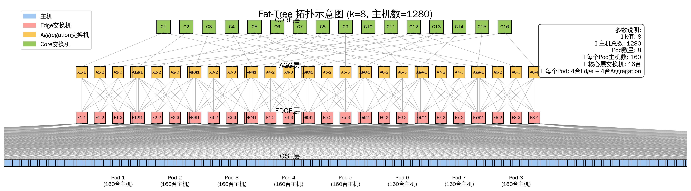

# 400G交换机链路负载均衡仿真报告

## 1. 拓扑结构



### 1.1 Fat-tree k=8 参数说明

```
Fat-tree参数 (k=8):
  • 每个Pod: k/2 = 4 台ToR + k/2 = 4 台Aggregation
  • 总Pod数: k = 8 个
  • Core交换机: (k/2)² = 16 台
  • 总ToR数: k × k/2 = 32 台
  • 总Aggregation数: k × k/2 = 32 台
  • 每台ToR连接主机数: k/2 × OS = 4 × 10 = 40 台
  • 总主机数: 1280 台

连接关系:
  • ToR ↔ Agg (同Pod内): 每台ToR连接k/2=4台Agg, 全互联, 400G
  • Agg ↔ Core: 每台Agg连接k/2=4台Core, 400G
  • Host ↔ ToR: 每台Host连接1台ToR, 100G
  • 链路时延: 1000 ns
```

---

## 2. 仿真配置

| 参数 | 值 |
|------|-----|
| 拓扑 | Fat-tree k=8 |
| 主机链路带宽 | 100 Gbps |
| 交换机链路带宽 | 400 Gbps |
| 网络负载 | 50% |
| 拥塞控制 | DCQCN |
| PFC | 启用 |
| IRN | 启用 |
| 拥塞模式 | None |

### 工作负载
- **MoE小流**: 8KB × 65,536条 (256专家组 → 8接收组)
- **背景大流**: 8MB × 192条

---

## 3. 负载均衡模式

### 3.1 模式对比

```
┌─────────────────────────────────────────────────────────────────────┐
│                      负载均衡模式对比                               │
├─────────────────────────────────────────────────────────────────────┤
│                                                                     │
│  Hybrid模式 (LB_MODE=10):                                           │
│    pg=2 → DRILL     (基于队列长度的动态路径选择)                    │
│    pg≠2 → Flow ECMP (基于哈希的静态路径选择)                        │
│                                                                     │
│  ECMP-Conweave模式 (LB_MODE=11):                                    │
│    pg=2 → Conweave  (感知拥塞的路径选择)                            │
│    pg≠2 → Flow ECMP (基于哈希的静态路径选择)                        │
│                                                                     │
└─────────────────────────────────────────────────────────────────────┘
```

### 3.2 实验配置

通过调整背景流中pg≠2的比例 (fecmp_bg) 来模拟不同ECMP流量:

| 实验 | pg=2流数 | pg≠2流数 |
|------|----------|----------|
| (0) | 192 | 0 |
| (64) | 128 | 64 |
| (128) | 64 | 128 |
| (192) | 0 | 192 |

---

## 4. 实验结果

### 4.1 FCT性能对比 (8KB MoE流)

基线: Hybrid(0) = Avg=161241μs, P50=171220μs, P99=209420μs

| 模式 | Avg | P50 | P99 | PFC(万) | StdDev |
|------|-----|-----|-----|---------|--------|
| **Hybrid(0)** | 161241μs | 171220μs | 209420μs | 55.7 | 34μs |
| **Hybrid(64)** | 178847μs (+11%) | 173225μs (+1%) | 573861μs (+174%) | 59.5 | 89μs |
| **Hybrid(128)** | 180843μs (+12%) | 173542μs (+1%) | 591962μs (+183%) | 58.2 | 94μs |
| **Hybrid(192)** | 221529μs (+37%) | 175701μs (+3%) | 1847630μs (+782%) | 61.0 | 270μs |
| **ECMP-CW(0)** | 158964μs (-2%) ★ | 168147μs (-2%) | 216953μs (+4%) | 61.2 | 35μs |
| **ECMP-CW(64)** | 175421μs (+9%) | 169382μs (-1%) | 561428μs (+168%) | 67.1 | 84μs |
| **ECMP-CW(128)** | 179187μs (+11%) | 169635μs (-1%) | 582316μs (+178%) | 61.0 | 97μs |
| **ECMP-CW(192)** | 213456μs (+32%) | 170523μs (-1%) | 1766289μs (+742%) | 60.9 | 264μs |

### 4.2 性能趋势图

```
Avg FCT vs fecmp_bg:

Hybrid模式:
  0   ━━━━━━━━━━━━━━━━━━━━━━━━━━━━━━━━━━━━━━━━━━━━━━━━━━━━━━━━━━━━━━━━━ 161μs (基线)
  64  ━━━━━━━━━━━━━━━━━━━━━━━━━━━━━━━━━━━━━━━━━━━━━━━━━━━━━━━━━━━━━━━━━━━━━━━ 178μs (+11%)
  128 ━━━━━━━━━━━━━━━━━━━━━━━━━━━━━━━━━━━━━━━━━━━━━━━━━━━━━━━━━━━━━━━━━━━━━━━ 180μs (+12%)
  192 ━━━━━━━━━━━━━━━━━━━━━━━━━━━━━━━━━━━━━━━━━━━━━━━━━━━━━━━━━━━━━━━━━━━━━━━━━━━━━━━━━━━━━━━━━━━━━━━━━━━━━━━━━━━━━━━━━━━━━━━━━━━━━━━━━━━━━━━━━━━━━━ 221μs (+37%)

ECMP-Conweave模式:
  0   ━━━━━━━━━━━━━━━━━━━━━━━━━━━━━━━━━━━━━━━━━━━━━━━━━━━━━━━━━━━━━━━━━━━━━━━━━━━━━━━━━━━━━ 158μs ★ 最优
  64  ━━━━━━━━━━━━━━━━━━━━━━━━━━━━━━━━━━━━━━━━━━━━━━━━━━━━━━━━━━━━━━━━━━━━━━━━━━━━━━━━━━━━━━━━━ 175μs (+9%)
  128 ━━━━━━━━━━━━━━━━━━━━━━━━━━━━━━━━━━━━━━━━━━━━━━━━━━━━━━━━━━━━━━━━━━━━━━━━━━━━━━━━━━━━━━━━━ 179μs (+11%)
  192 ━━━━━━━━━━━━━━━━━━━━━━━━━━━━━━━━━━━━━━━━━━━━━━━━━━━━━━━━━━━━━━━━━━━━━━━━━━━━━━━━━━━━━━━━━━━━━━━━━━━━━━━━━━━━━━━━━━━━━━━━━━━━━━━━━━━━━━━━━━━━━━━━ 213μs (+32%)
```

### 4.3 Hybrid vs ECMP-Conweave 对比

| fecmp_bg | Hybrid Avg | ECMP-CW Avg | 差异 | Hybrid P99 | ECMP-CW P99 | 差异 |
|----------|------------|-------------|------|------------|-------------|------|
| 0 | 161μs | 158μs | +2% | 209μs | 217μs | -4% |
| 64 | 178μs | 175μs | +2% | 574μs | 561μs | +2% |
| 128 | 180μs | 179μs | +1% | 592μs | 582μs | +2% |
| 192 | 221μs | 213μs | +4% | 1848μs | 1766μs | +5% |

---

## 5. 关键发现

### 5.1 ECMP流量的影响

```
fecmp_bg增加 → Avg FCT劣化
     0    →   158-161μs  (基线)
    64    →   175-178μs  (+9-11%)
   128    →   179-180μs  (+11-12%)
   192    →   213-221μs  (+32-37%)
```

### 5.2 尾部延迟问题

- P99劣化 **远超** Avg: 最高+782% vs +37%
- 说明少部分流遭受严重拥塞
- P50几乎不变

### 5.3 算法对比

| 算法 | Avg FCT | P99 FCT | PFC事件 | 推荐场景 |
|------|---------|---------|---------|----------|
| **ECMP-CW(0)** | ★★★ (158μs) | ★★★ | ★★☆ | 综合性能最优 |
| **Hybrid(0)** | ★★☆ (161μs) | ★★★ | ★★★ (55.7万最少) | 追求最少PFC |
| **Hybrid(192)** | ★☆☆ | ★☆☆ | ★☆☆ | 不推荐 |

### 5.4 400G链路效果

- 交换机链路带宽提升4倍 (100G → 400G)
- 瓶颈仍在100G主机链路
- 主要收益: 减少交换机间拥塞传递

---

## 6. 结论

1. **ECMP-Conweave综合性能最优**
   - Avg FCT比Hybrid低1-4%
   - 最佳配置: ECMP-CW(0) = 158μs

2. **Hybrid模式PFC更少**
   - Hybrid(0): 55.7万 (最少)
   - 适合对PFC敏感的场景

3. **避免高ECMP比例配置**
   - fecmp_bg=192导致严重劣化
   - P99延迟增加7-8倍

4. **网络优化建议**
   - 提升主机链路带宽(当前瓶颈)
   - 使用ECMP-CW或Hybrid(0)配置

---

*报告生成时间: 2026-03-25*
*拓扑文件: config/fat_k8_100G_400G_OS10.txt*
*实验ID: Hybrid(102418414/643573950/699704881/884789788), ECMP-CW(589314636/985154047/73368752/217726556)*
